<!-- ============ HEADER ============ -->

  

<!-- ============ WHOAMI ============ -->
<h3 align="center"><code>nvhai272@github:~$ whoami</code></h3>

  

<!-- ============ STACK ============ -->

   
   
   
  
  

<!-- ============ LINKS ============ -->
<h3 align="center"><code>nvhai272@github:~$ ./links.sh</code></h3>

  
  
  

<code>nvhai272@github:~$ <b>█</b></code>

